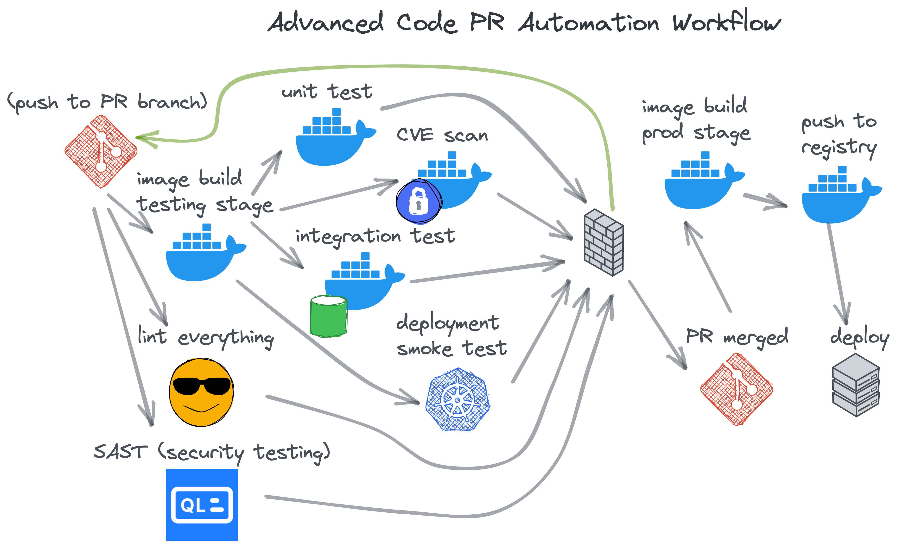

# Continues Integration for Traveling Merchant

The main purpose of this project is to implement continuos integration (CI) and cementing my knowledge on docker into my exisiting full stack application. In this project, I use docker to improve development workflow and implement CI with github actions. My original goal was to apply docker as much as possible from my studying of docker's documentation and other sources of its main concepts. Although, I revisited source from studying docker that I found a good docker course from DevOps Directive which in turn lead me to another gem of a video from Bret Fisher on using github actions with docker for CI autimation. Both these sources greatly shaped this project and are the same with my implementation considering my projects structure. Check sources section at the bottom for the links of both sources.

## Features

All the new features are shown in the root directory by the files and the folders .github/workflows and manifests. The following docker compose files are used for development workflow for the full stack application:

- docker-compose-dev.yml
- docker-compose-test.yml

These files used together can hot reload on changes to and use VS code debugging in a docker container. Test can be run in "docker-compose-test.yml" to run all tests for backend. Integration tests in backend can be run using "docker-compose.integration-test.yml", also used as a step in github actions backend workflow. "docker-compose.yml" will run the full stack application in production environment."docker-compose-backend.yml" will just run the backend application.

The github actions for pushing to main has two workflows backend and frontend where each runs to check everything is good with the each part of the full stack application. The frontend workflow has a simple one job implementation of security scanning the docker image created for the frontend application. While, the backend workflow runs a total of 6 jobs where 4 run concurrently shown in the diagram below:

_This the diagram of the github action backend workflow created by Bret Fisher from the docker-ci-automation github repository_

In this workflow, a push to main will trigger a job build a test image of the backend application and pushed to docker hub that will be used for the next concurrent jobs. The next jobs that are triggered check for unit tests, integration tests, checking backend app works in a kubernetes cluster using k3d, and security scanning the image. Finally, the last job build and pushes the backend application in a production environment.

There is a make file full of useful scripts you can run. It is sectioned off in four sections:

- Docker run - docker build and run images such as postgres database, redis, backend, vite frontend, and nginx frontend.
- Docker Compose - docker compose the full stack application with in different environments and for testing.
- Backend CI with github actions - test jobs and/or steps locally using:
  - nektos/act - run github actions locally
  - docker - run unit tests, integration tests, and security scan
  - k3d - run k3d kubernetes cluster with backend app
- Frontend CI with github actions - test whole workflow (one job) using nektos/act.

## How to use

Follow MakeFile closely since its well documented and make sure to create your ci.env file with all variables as instructed by sample-ci.env.

## Technologies

The technologies and/or frameworks used in this project will be sectioned off. The root and also the working directory this repository focuses on has:

- make - build automation tool
- k3d - running containerized k3s kubernetes clusters
- nektos/act - tool that run Github actions locally
- Docker - open source platform for containers
- Visual Studio Code - code editor

For the backend:

- Swagger - suite of tools for documenting APIs
- Mocha/Chai/Axios - suite of npm modules used for making tests
- Sequelize - object-related mapping (ORM) for postgresql
- Express.js - web application framework
- nvm - nodejs version control
- PostgreSQL - relational database
- Redis - non-relational database
- Node.js (22.16.0) - Javascript runtime
- Visual Studio Code - code editor

For the frontend:

- Axios - making api requests
- React.js - front end web application framework
- nvm - nodejs version control
- Node.js (22.16.0) - Javascript runtime
- Visual Studio Code - code editor

## License

MIT license

This is showed on the text file "LICENSE.txt" in the repository.

## Whats Next

Next I plan to apply kubernetes knowledge and try to apply message brokers, search engines, and real time-data.

## Sources

The following are the sources I used to learn and implement about new topics or techonologies that are not documentations:

- [DevOps Directive Docker course](https://courses.devopsdirective.com/docker-beginner-to-pro/lessons/00-introduction/01-main) - This is a great guide on docker and how to use it for development. I started to follow and use the content starting at section 6 and modified the docker compose and dockerfiles. This made me aware using MakeFile to automate running scripts.
- [Bret Fisher Docker CI Automation](https://github.com/BretFisher/docker-ci-automation) - This is a feature guide on how to use GitHub actions with docker to automate CI workflow. Used the "99-parallelize-jobs.yaml" as a template for my backend that also has k8s manifests.
