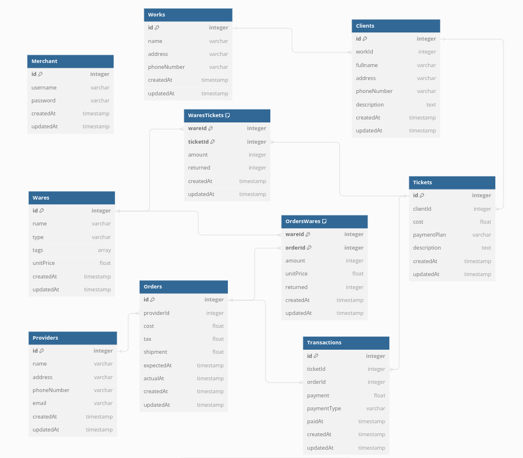

# Traveling Merchant

Traveling Merchant is a backend application to keep track of money transactions and inventory of a merchant selling and buying wares. The purpose of this project is to use all of my learned knowledge of backend application to create an app that will help my mom that has a small business. The schema for the database used is shown below:

## Features

There are only one type of users and those are merchants that have all access to the api. Merchant creates tickets for clients that represent a purchase of specific wares. The ticket keeps track of the total payment, how much is still owed, and the payment plane ("lump sum", "weekly", "biweekly", etc). Wares can be restocked by buying from providers through making orders for wares. The money transactions for restocking and selling wares are tracked through transactions.

Returning wares is allowed for restocking and selling them. Then how much is still owed and the stock of wares is automatically updated.

## How to use

The following are the requirements:

- Download repository and install dependencies.
- Install nvm in you operating system and run "nvm use" in the project directory terminal to run a unified Node.js version of v18.0.0.
- Create a .env file on the outermost project directory (./) so you can fill out this file while going through this guide.
  - A sample.env file is provided to show all the required keys to fill out and has dummy values on how they should look like.

Next, create a database and insert the url database into the respective key-value pair on the .env file. The following are the types of enviorments and when you need a database for the specific enviorment:

- development enviorment: If you would like a less strict version of the app.
- test enviorment: If you would like to run the tests.
- production enviorment: If you would like to use it in a more real use case.

Install redis locally for caching and rate limiters. Then create secret keys are needed for express-session and csrf-csrf cookies.

Here are the following commands on the project directory terminal and their use:

- npm start-dev: initialize the app in a developement enviorment
- npm test: run all the tests
- npm no-pretests: run all tests without running pre-test commands

Note:

- To use protected routes one will have to save the CSRF token from the response payload on a succesful login. Then set the headers on their requests with "x-csrf-token" to equal the provided CSRF token.

## Technologies

These are the technologies and/or frameworks used:

- Node.js (v18.0.0) - Javascript runtime
- Express.js - web application framework
- Mocha/Chai/Axios - suite of npm modules used for making tests
- Swagger - suite of tools for documenting APIs
- PostgreSQL - relational database
- Sequelize - object-related mapping (ORM) for postgresql
- Redis - non-relational database
- Visual Studio Code - code editor

## Collaborators

I had no collaborators.

## License

MIT license

This is showed on the text file "LICENSE.txt" in the repository.

## What I learned

During this project I learned the repeating process of writting the basic CRUD operations. Such I made a program to write a skeleton to writting crud operations. The same thing occured for creating the yaml file for api documentation using swagger editor.

## Whats next

Next in my learning journey I will review and continue this project by learning how to build a frontend and connecting frontend and backend.

## Sources

The knowledge of creating my backend applicaiton was through my previous projects. Check out my previous project (caption) for good sources.
